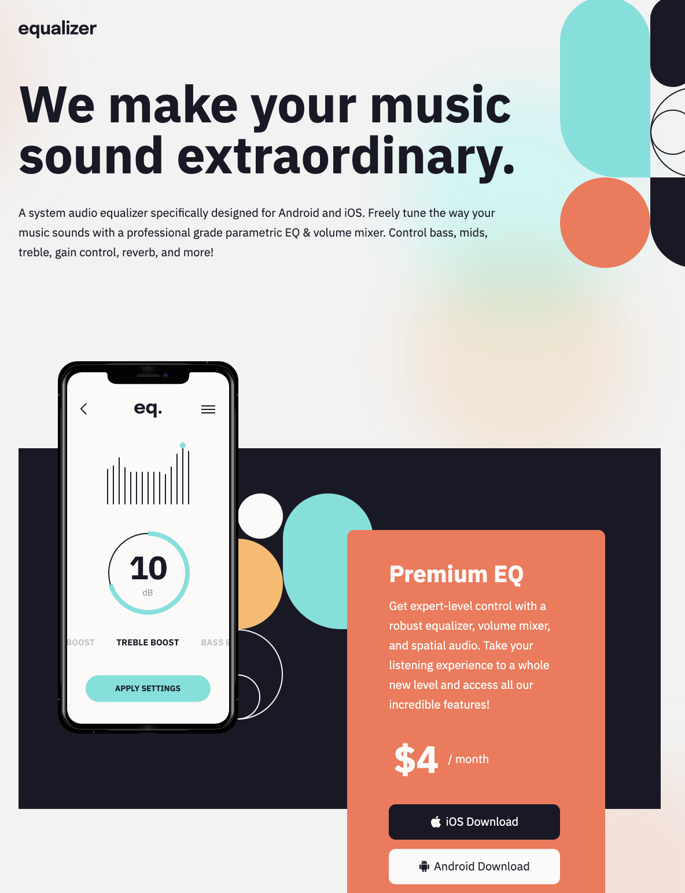

Live Site URL: [Click Here](https://mrfinesse47.github.io/equalizer-landing-page/)

# Frontend Mentor - Equalizer landing page solution

This is a solution to the [Equalizer landing page challenge on Frontend Mentor](https://www.frontendmentor.io/challenges/equalizer-landing-page-7VJ4gp3DE). Frontend Mentor challenges help you improve your coding skills by building realistic projects.

## Table of contents

- [Overview](#overview)
  - [The challenge](#the-challenge)
  - [Screenshot](#screenshot)
  - [Links](#links)
- [My process](#my-process)

  - [Built with](#built-with)
  - [What I learned](#what-i-learned)

- [Acknowledgments](#acknowledgments)

## Overview

### The challenge

Users should be able to:

- View the optimal layout depending on their device's screen size, mobile/tablet/desktop
- See hover states for interactive elements

### Screenshot



#### - The main layout

### Links

- Live Site URL: [Click Here](https://mrfinesse47.github.io/equalizer-landing-page/)

## My process

nothing too serious for this exercise.

- plan - code - test/compare - repeat

### Built with

- Semantic HTML5 markup
- Flexbox
- SASS

- No JS in this project

### What I learned

The biggest thing I learned in this project was how to add multiple background images, I found that the background image that comes first has a higher Z index.

```css
background-image: url("/assets/bg-pattern-1.svg"),
  url("./assets/bg-main-desktop.png");
background-position: left 1128px top 0px, left -330px top -200px;
background-size: 312px 468px, auto;
background-repeat: no-repeat, no-repeat;
```

## Acknowledgments

Thank you to community in the way that knowledge is shared, it wouldn't be possible to accomplish anything without your stack overflows of the world.
